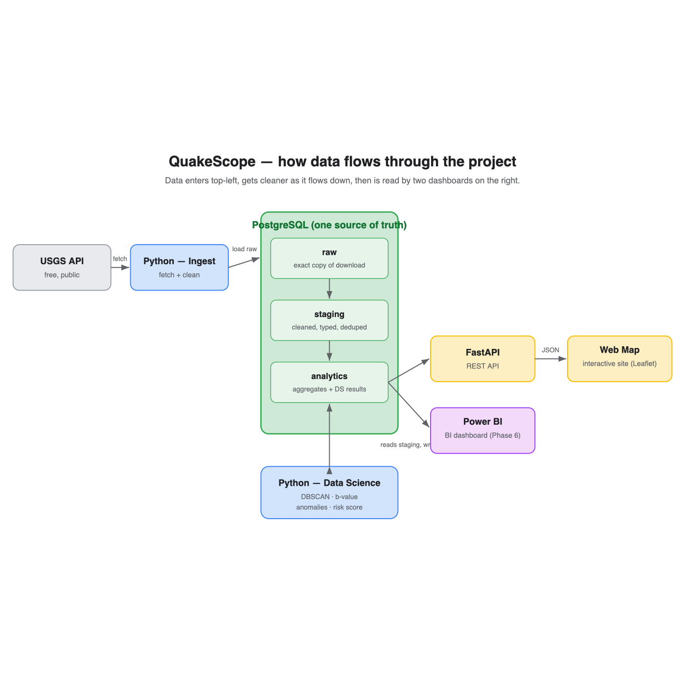

# QuakeScope 🌍

QuakeScope takes every sizable earthquake on Earth and turns it into something you can actually understand. It pulls the data from the USGS, stores it in a real database, runs genuine seismology analysis on it, and then serves the results two ways: as a web API and as a live map you can click around.

The whole thing runs on 124,479 real earthquakes from 2010 to today, magnitude 4.5 and above, worldwide.


## The questions I wanted to answer

The goal was never to scatter dots on a map. It was to answer things people actually wonder about.

Is the world really shaking more than it used to? Where are the dangerous zones, and how would you rank them? How do aftershocks die down after a big quake, and how are earthquake sizes really distributed?

## What the data says

A handful of findings stood out.

* The world is not shaking more. A Mann Kendall trend test across 2010 to 2025 returns p = 0.93, meaning there is no real trend. The sense that earthquakes are on the rise comes from better sensors and more headlines, not from the planet itself.
* There are 207 distinct seismic zones, and the clustering found every one of them on its own. Plotted out, they trace the Pacific Ring of Fire almost perfectly.
* Earthquake sizes follow the Gutenberg Richter law closely, with a b value near 1.17.
* A tiny number of giants dominate everything. The 2011 magnitude 9.1 Tohoku quake on its own released roughly 30% of all the seismic energy in the dataset, and the 15 quakes of magnitude 8 and above released about 70% of it.
* Japan ranks as the highest risk zone, followed by Tonga, Kamchatka, Chile, and Vanuatu.
* The anomaly detection, with no hints from me, picked out the 2013 Sea of Okhotsk quake (magnitude 8.3, 598 km deep) as the single most unusual event. That one happens to be the largest deep focus earthquake ever recorded.

One honest note. This work describes hazard, it does not predict earthquakes, because no one can. The b value sitting a little above 1.0 most likely comes from the USGS mixing different magnitude types, and sixteen years simply is not long enough to capture the full run of giant quakes.

## How it is built

Python handles the ingestion and analysis. The data lives in PostgreSQL and is shaped with SQL. The data science uses scikit learn (for the DBSCAN clustering and the Isolation Forest), along with SciPy and NumPy. The API is FastAPI and the map is built with Leaflet. A Power BI dashboard is planned for later, as noted in the roadmap.

Everything flows through one database, which acts as the single source of truth. Both the API and the map simply read from it.



## The analysis methods

* Spatial clustering with DBSCAN to find the seismic zones.
* The Gutenberg Richter b value, using the Aki maximum likelihood estimate, for the relationship between size and frequency.
* Mann Kendall trend testing and Omori's law for the questions about time, namely whether activity is rising and how aftershocks fade.
* An Isolation Forest plus monthly z scores to surface unusual quakes and unusual months.
* A seismic energy calculation and a composite risk score to rank the regions.

## A couple of results

The seismic zones found by clustering:


The Gutenberg Richter law holding on the data:


## Project layout

```
quakescope/
  src/        the Python code, one file per job (ingest, load, the five analyses)
  sql/        the SQL that builds the clean table
  api/        the FastAPI app
  web/        the Leaflet map (index.html + app.js)
  docs/       walkthroughs and diagrams
  data/raw/   downloaded data, kept out of git
  run_all.sh  rebuilds the whole pipeline in one go
```

## Running it yourself

You will need macOS with Homebrew, Python 3.11 or newer, and PostgreSQL.

```bash
brew install postgresql@17 && brew services start postgresql@17
```

Set up the project:

```bash
python3 -m venv .venv
.venv/bin/python -m pip install -r requirements.txt
cp .env.example .env
createdb quakescope
```

Build everything (this runs the full pipeline, from raw data through every analysis):

```bash
./run_all.sh
```

Launch the API and the map:

```bash
.venv/bin/uvicorn api.main:app --reload
```

Then open http://127.0.0.1:8000/app/ for the map and http://127.0.0.1:8000/docs for the API documentation.

## Roadmap

✅ Pull the USGS data
✅ PostgreSQL and SQL modelling
✅ Data science, five families of methods
✅ FastAPI REST API
✅ Interactive web map
✅ Polished, reproducible repo
⬜ Power BI dashboard, waiting on a Windows setup since Power BI Desktop is Windows only
⬜ Optional free cloud deploy

## Data and credits

The earthquake data comes from the U.S. Geological Survey Earthquake Catalog and is public domain. Map tiles are from OpenStreetMap contributors. I built this as a learning and portfolio project.
