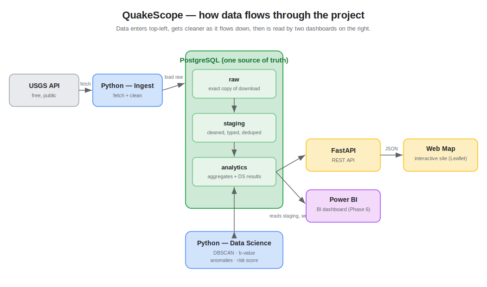

# How the project is organised (and why)

You asked me to investigate an architecture decision a few times before committing,
and to explain it. So here's the decision — **how should the code and data be
laid out?** — checked from three different angles, then the answer.

First, the picture. (If it doesn't show, open this file with VS Code's Markdown
preview: right-click → *Open Preview*.)

---

## The three angles I checked

### Angle 1 — "How do professional data teams do it?"

The standard pattern in industry is to move data through **layers**, where each
layer is a bit cleaner than the last. A very common version has three:

- **raw** — the data exactly as it arrived, untouched. If we mess something up
  later, we can always go back to this.
- **staging** — the same data, but cleaned: correct types, no duplicates, sensible column names.
- **analytics** — the useful end-tables: summaries, plus the results of our data science (clusters, risk scores).

This is sometimes called a "medallion" or "bronze/silver/gold" layout. The point
is simple: **never analyse raw data directly** — clean it in steps so each step
is easy to check.

### Angle 2 — "What's easiest for *me* to follow as I learn?"

The clearest structure for learning is **one folder per job**, named after what
it does — not clever, abstract programming patterns. When you open the repo, you
should be able to read the folder names top-to-bottom and understand the whole
pipeline:

> get the data → put it in the database → analyse it → serve it → show it

No hidden magic, no deep nesting. Each script does one obvious thing.

### Angle 3 — "What do the two end-products actually need?"

We have two things reading the data at the end: the **FastAPI web app** and
**Power BI**. I checked what each one wants, and they want the *same thing*:
clean, well-named tables they can read directly from PostgreSQL.

That gives us a useful rule: **the database is the single source of truth.** Both
dashboards read from the `analytics` tables — they never re-do the analysis
themselves. We do the hard work once, store it, and both just read it. (Bonus:
Power BI connects to PostgreSQL natively, so this "just works" later.)

---

## The decision (where the three angles agree)

All three point the same way, so here's the layout we'll use.

**Folders in the repo** — one per job in the pipeline:

| Folder | Its job |
|---|---|
| `src/` | the Python code, with a file per step: `ingest` (get data), `load` (into the database), `analyze` (the data science) |
| `sql/` | the SQL that builds the clean tables (the raw → staging → analytics steps) |
| `notebooks/` | scratch space for exploring the data before we commit to real code (Phase 3) |
| `api/` | the FastAPI web app (added in Phase 4) |
| `web/` | the interactive map website (added in Phase 5) |
| `docs/` | these learning docs |
| `data/raw/` | downloaded files land here; not uploaded to GitHub (they're big and re-downloadable) |

**Layers inside PostgreSQL** — we'll use the three layers above as real,
separate areas in the database (Postgres calls them *schemas*): `raw`, `staging`,
`analytics`. This keeps "messy incoming data" and "clean final data" clearly
apart, and it's a genuine professional habit worth learning.

We add `api/` and `web/` only when we reach those phases, so the repo never has
empty folders sitting around confusing you.

---

## One thing we deliberately skipped (for now)

There's a popular tool called **dbt** that automates the raw → staging →
analytics SQL steps. We're **not** using it yet — on purpose. You said you'd
rather learn the thing properly than skip to the tool, so we'll write those SQL
steps by hand first. Once you've *felt* what dbt would do for you, adding it
later (as a bonus) will actually make sense instead of being magic. Your call.
