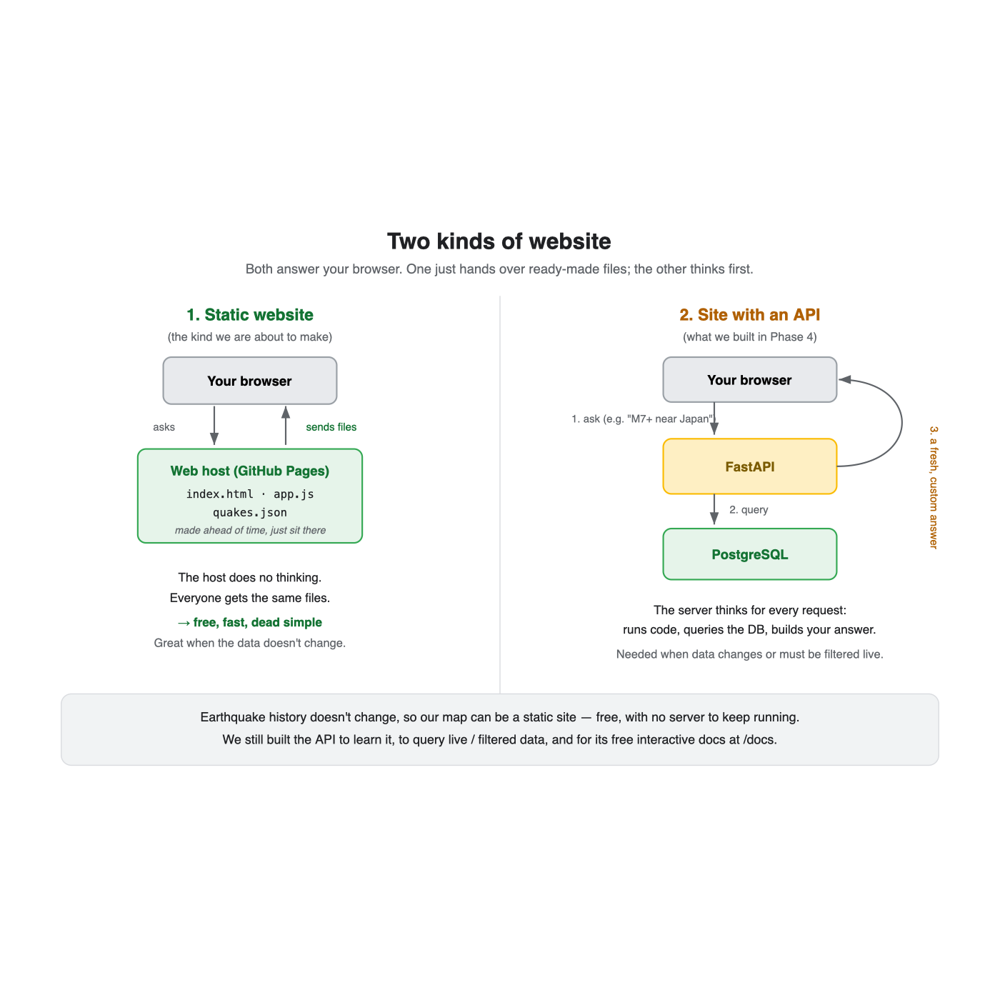

# How to make a website (a plain-language guide)

This explains, from the ground up, how a website is built and put online, using the
QuakeScope map as the worked example. No prior web knowledge assumed.

---

## 1. What a website actually is

A website is just **files that a browser knows how to read**. Three languages do
three jobs, and you have already seen all three:

* **HTML** is the *structure* (the bones). It says what is on the page: a header, a
  box for the map, a legend. Written in tags like `
`.
* **CSS** is the *style* (the looks). Colours, spacing, fonts. Our map uses an earthy
  palette set in a `<style>` block.
* **JavaScript** is the *behaviour* (the actions). It runs inside the browser and makes
  things happen: drawing the map, loading data, reacting to button clicks.

That is the whole foundation. Everything else is built on those three.

## 2. Two kinds of website: static and dynamic

This is the most important idea, and it decides how hard your site is to host.

* A **static website** is a set of finished files that the host hands over exactly as
  they are. No server does any thinking. It is cheap, fast, and very hard to break.
* A **dynamic website** has a server (often with a database and an API) that builds a
  fresh answer for each visit. More powerful, but something has to keep running.

**Rule of thumb:** if your data does not change per visitor, make it static. Our
earthquake history is fixed, so the map is static. We export the data to a JSON file
once, and the browser does the rest.

## 3. The pieces of a simple website

For a static site like ours you need:

1. **`index.html`** — the page itself. The browser always looks for this first.
2. **A stylesheet** — ours is inline in the HTML; bigger sites use a separate `.css`.
3. **JavaScript** — `app.js`, the behaviour.
4. **Any data or libraries** — our `data/quakes.json`, plus the Leaflet map library,
   which we load from a public address (a CDN) instead of installing.

## 4. How "putting it online" works

A website lives on a **host**: a computer, always on, that hands your files to anyone
who asks via a web address. You do not need to own a server. Free hosts exist, and the
simplest for a code project is **GitHub Pages**, which serves files straight from your
GitHub repository. Your address becomes something like
`https://username.github.io/project/`.

## 5. How we actually shipped the QuakeScope map

1. **Built the page** — `web/index.html` (structure + style) and `web/app.js`
   (behaviour, using Leaflet for the map).
2. **Exported the data** — a small Python script wrote `web/data/quakes.json` so the
   map needs no backend.
3. **Tested it locally** — we ran a tiny local web server and opened the page in a
   browser. (You cannot just double-click the HTML, because browsers block a page from
   loading data files straight off the disk for safety. A local server fixes that.)
4. **Deployed to GitHub Pages** — a small automated job publishes the `web/` folder
   every time we push. The map then lives at a public URL, for free, with nothing to
   keep running.

## 6. Security: what to watch on any website

You said you do not want to leak anything. The key rules:

* **Anything sent to the browser is public.** HTML, CSS, JavaScript and data files can
  all be read by anyone who visits. So **never put secrets in them** — no passwords, no
  private API keys, no personal data.
* **Keep secrets in `.env` and out of git.** Our database settings live in `.env`,
  which is gitignored, so they never reach GitHub or the website.
* **Check what you publish.** Before going live we scanned the files for passwords and
  internal addresses, and confirmed the data was only public earthquake records.
* **A static site has almost no attack surface.** With no server and no database
  exposed to the internet, there is nothing to hack into. That is a real security win,
  not just convenience.
* If you later add a real backend, that is when you must think harder: validate input,
  never build SQL by gluing in user text, and lock down who can call your API.

## 7. The short version

A website is HTML, CSS and JavaScript. If the data does not change, make it static and
host it free on GitHub Pages. Keep every secret out of the files you publish, and a
static site stays safe because there is nothing behind it to attack.
