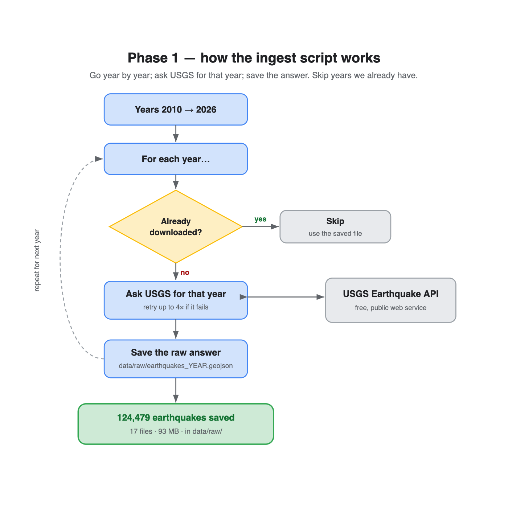

# Session 01 — Pulling the data (Phase 1)

**What we did:** wrote a small Python program that downloaded **124,479 real
earthquakes** (2010–2026, magnitude 4.5+, worldwide) from the USGS and saved them
to your disk.



---

## Part A — Python, from the simplest idea upward

Every idea below is shown with a **real line from our script** (`src/ingest.py`).
Read them top to bottom; each one is a small step up from the last.

### 1. A variable — a name that holds a value
```python
MIN_MAGNITUDE = 4.5
```
`MIN_MAGNITUDE` is just a label we stuck on the number `4.5`. Now we can write
`MIN_MAGNITUDE` anywhere instead of repeating `4.5`, and change it in one place.

### 2. A string — text, written in quotes
```python
USGS_URL = "https://earthquake.usgs.gov/fdsnws/event/1/query"
```
Anything in quotes is text (a "string"). This one holds the web address we ask.

### 3. An f-string — a string with a value slotted in
```python
f"{year}-01-01"
```
The `f` lets us drop a variable inside the text. If `year` is `2011`, this becomes
`"2011-01-01"`. We use it to build the start/end dates for each year.

### 4. A dictionary — a labelled bag of values
```python
params = {
    "format": "geojson",
    "minmagnitude": MIN_MAGNITUDE,
}
```
A dictionary stores **key → value** pairs. Here it's the list of settings we send
to USGS: "format" is "geojson", "minmagnitude" is 4.5, and so on. Think of it like
filling in a form.

### 5. Using a library — borrowing code someone else wrote
```python
response = requests.get(USGS_URL, params=params, timeout=180)
```
`requests` is a library (a toolbox) for talking to websites. `.get(...)` means
"go fetch this web address with these settings." We didn't write the internet
plumbing — we borrowed it. `timeout=180` says "give up if it takes over 3 minutes."

### 6. A function — a named, reusable block of steps
```python
def fetch_one_year(year):
    ...
    return response.json()
```
`def` defines a function. This one is a little machine called `fetch_one_year`:
you hand it a year, it does the work, and `return` hands back the result. We can
now reuse it for every year instead of copying the code 17 times.

### 7. A loop — do the same thing for each item
```python
for year in range(START_YEAR, END_YEAR + 1):
    ...
```
`range(2010, 2027)` is the years 2010…2026. The `for` loop runs the indented code
**once per year**. This is what makes 17 downloads happen from a few lines.

### 8. An if — make a decision
```python
if out_file.exists():
    ...
    continue
```
`if` runs code only when something is true. Here: *if* we already saved this year's
file, `continue` skips straight to the next year. That's the "resume" feature —
it's why re-running didn't re-download 2010.

### 9. try / except — handle things going wrong
```python
try:
    response = requests.get(...)
    return response.json()
except requests.exceptions.RequestException:
    ...
    time.sleep(wait)   # wait, then the loop tries again
```
`try` runs code that *might* fail (the network!). If it throws an error, `except`
catches it instead of crashing — so we wait and retry. This is exactly what saved
us when 2011 timed out the first time.

### 10. Files and JSON — saving the data
```python
out_file.write_text(json.dumps(data))
```
- `json.dumps(data)` turns Python data back into text (JSON is just a text format
  for data).
- `write_text(...)` writes that text into a file on disk.

That's the whole toolbox. The script is really just **#7 (a loop)** wrapped around
**#5 (a web request)** and **#10 (saving a file)**, with **#8/#9** to make it
robust.

---

## Part B — Two real-world lessons baked in

**Validate before building.** Before writing the script, we tested the USGS API
live. That's how we caught that `orderby=time-desc` is invalid (the API only
accepts `time`, `time-asc`, `magnitude`, `magnitude-asc`) — *before* it could
become a bug.

**Real downloads are flaky, so be resilient.** Our first run died when 2011 timed
out. We added two habits every data engineer uses:
- **Retry** — if a request fails, wait and try again a few times.
- **Resume** — skip work already done, so a restart continues where it left off.

---

## Part C — Why magnitude 4.5?

We didn't grab *every* quake. The USGS records every quake of magnitude ~4.5+
**everywhere on Earth**, but smaller ones are only caught near sensors (mostly the
USA). If we included them, the "world" would look like it's mostly shaking in
California — a bias. Choosing 4.5+ gives an honest global picture. *(This kind of
thinking — questioning whether the data is fair — is the heart of analysis.)*

---

## Result & what's next

- **124,479 earthquakes**, 2010–2026, saved as 17 files in `data/raw/` (93 MB).
- The biggest in our data: **M9.1, the 2011 Great Tōhoku Earthquake, Japan**.

These files are still **raw** — exactly as USGS sent them, nested and messy.
**Phase 2** is where we learn **SQL**: we load this into PostgreSQL and shape it
into a clean, flat table we can actually ask questions of.
