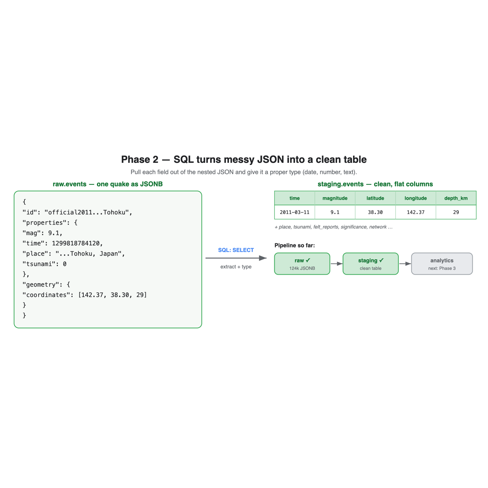

# Session 02 — SQL & PostgreSQL (Phase 2)

**What we did:** loaded all 124,479 quakes into PostgreSQL, used **SQL** to turn the
messy JSON into a clean table, then asked the data its first questions.



---

## Part A — SQL, from the simplest idea upward

Same approach as the Python doc: each idea is a small step up, shown with the real
SQL we ran.

### 1. The big picture: database → schema → table
- A **database** (`quakescope`) is the whole filing cabinet.
- A **schema** is a drawer in it. We made three: `raw`, `staging`, `analytics` —
  the "layers" from our architecture (messy → clean → results).
- A **table** is a sheet of data: rows (one per quake) and columns (the fields).

```sql
CREATE SCHEMA IF NOT EXISTS staging;
```

### 2. Holding raw JSON: the JSONB type
We first copied each quake into `raw.events` **exactly as it arrived**, in one
column of type **JSONB** (Postgres's format for JSON). One quake = one row.

```sql
CREATE TABLE raw.events (id text, raw jsonb);
```

### 3. Reading inside JSON, and converting types
To build the clean table we pull fields out of that JSON. Three new pieces of SQL:

```sql
 raw -> 'properties' ->> 'mag'            -- ->> gets a piece as text  ("9.1")
(raw -> 'properties' ->> 'mag')::numeric  -- ::  converts it to a number (9.1)
to_timestamp(... / 1000.0)                -- turns a raw timestamp into a real date
```
- `->` digs into JSON and stays JSON; `->>` digs in and gives plain **text**.
- `::numeric` / `::int` **convert** that text into a proper number.

That's the whole `staging_events.sql` transform: one big `SELECT` that lists each
field, extracts it, and types it.

### 4. The simplest query: count the rows
```sql
SELECT count(*) FROM staging.events;   -- 124,479
```
`SELECT` = "give me…". `count(*)` = "how many rows". `FROM` = "from this table".

### 5. Choose columns, sort, limit: the 5 strongest quakes
```sql
SELECT event_time, magnitude, place
FROM staging.events
ORDER BY magnitude DESC      -- biggest first
LIMIT 5;                     -- just the top 5
```

### 6. WHERE — keep only rows that match
```sql
SELECT count(*) FROM staging.events
WHERE magnitude >= 7;        -- 252 major quakes
```
`WHERE` is the filter. Everything that isn't true is dropped before counting.

### 7. GROUP BY — bucket rows and summarise each bucket
```sql
SELECT date_part('year', event_time)::int AS year,
       count(*) AS quakes
FROM staging.events
GROUP BY year
ORDER BY year;
```
This collapses 124k rows into **one row per year**, counting each. It's how you go
from raw data to a summary — the bread and butter of analysis.

### 8. Indexes — making questions fast
```sql
CREATE INDEX idx_events_time ON staging.events (event_time);
```
An index is like a book's index: instead of scanning every row, Postgres jumps
straight to the ones it needs. We added indexes on time, magnitude, and location.

---

## Part B — What the data already told us

| Question | SQL idea | Answer |
|---|---|---|
| How many quakes? | `count(*)` | **124,479** |
| Strongest? | `ORDER BY … LIMIT` | **M9.1 Tōhoku**, then M8.8 Kamchatka (2025) & Chile |
| Major (M7+)? | `WHERE` | **252** |
| Tsunami-flagged? | `WHERE tsunami = 1` | **1,381** |
| Trend over time? | `GROUP BY year` | **flat — ~6,400–9,600/yr, no clear rise** |

That last one is the interesting one: at magnitude 4.5+, the world isn't obviously
shaking more over time. Whether that holds up is a Phase 3 question.

---

## Part C — Two professional habits we used

**Check data quality.** We compared `count(*)` to `count(DISTINCT id)` — both were
124,479, proving there are **no duplicate quakes**. Always sanity-check after loading.

**Mind your timezones.** Our per-year counts shifted by a handful versus Phase 1,
because Postgres displays times in your local zone (UTC+7) and a few quakes near
New Year cross the boundary. We'll standardise on UTC in Phase 3 so the analysis is
exact.

---

## Result & what's next

- `raw.events` (124,479 JSONB rows) → `staging.events` (124,479 clean, typed rows).
- You can now answer real questions with `SELECT … FROM … WHERE … GROUP BY`.

**Phase 3** is the data science: we'll use **Python** to find earthquake clusters
(DBSCAN), measure the Gutenberg–Richter b-value, spot anomalies, and score regional
risk — then write the results back into the `analytics` schema.
