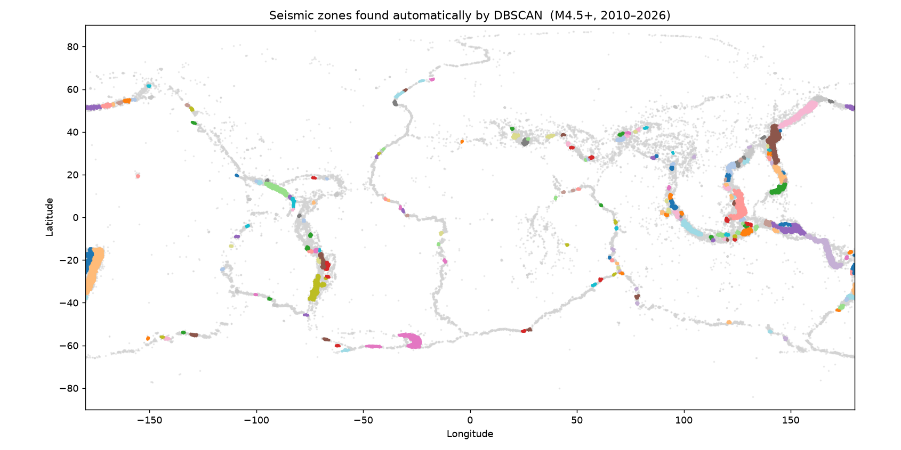
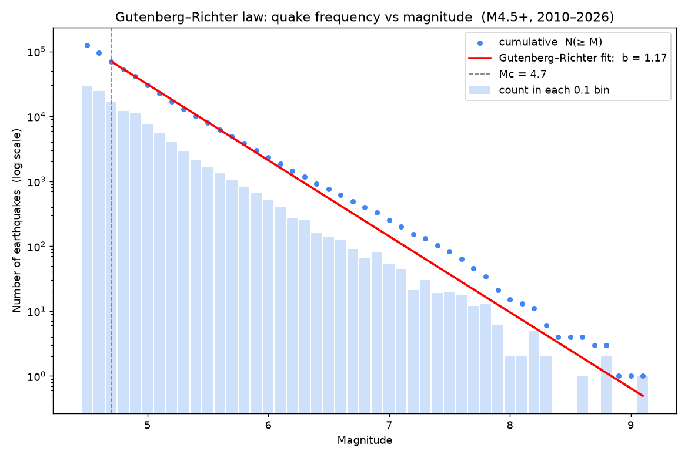

# Session 03 — Data Science, Part 1 (Phase 3)

**What we did:** two real seismology techniques in Python — found the world's
seismic zones automatically (**DBSCAN**), and measured the **Gutenberg–Richter
b-value** — and saved the results into the `analytics` schema.

---

## Method A — Finding seismic zones with DBSCAN

### The idea, simplest first
- **Clustering** = grouping points that are close together.
- **DBSCAN** is a clustering method based on **density**: it walks through the
  quakes and wherever it finds a dense crowd, it calls that a cluster (a seismic
  zone). Quakes sitting alone in empty areas get labelled **noise** and left out.
- We gave it two settings: a quake within **~50 km** of a crowd joins it (`eps`),
  and a crowd needs at least **40 quakes** to count (`min_samples`).
- One important detail: the Earth is round, so we measured distance the round-Earth
  way (**haversine** / great-circle), not as if the map were flat.

The key point: **we never told it where the zones are.** It discovered them.

### What it found
- **207 seismic zones**; 93,675 quakes fell into a zone, 30,804 were scattered noise.
- The biggest zones are the **Pacific Ring of Fire**: Tonga, Japan, Vanuatu, the
  Philippines, Chile, Kamchatka… The faint gray trails are the mid-ocean ridges
  (real, but too sparse to pass the 40-quake bar).

| Zone (top region) | Quakes | Strongest |
|---|---|---|
| Tonga | 11,345 | M8.1 |
| Japan | 8,751 | **M9.1** (Tōhoku) |
| Vanuatu | 8,661 | M8.0 |
| Philippines | 7,566 | M7.8 |
| Chile | 2,943 | M8.8 |

**Why this matters:** the result matches real geology with no input from us — the
strongest possible sanity check that the method and data are sound.

---

## Method B — The Gutenberg–Richter b-value

### The idea, simplest first
- Small quakes are common; big ones are rare. The **Gutenberg–Richter law** makes
  that precise: each step up in magnitude means a roughly **constant** drop in how
  many quakes there are.
- On a **log scale**, a constant factor looks like a **straight line**. The slope
  of that line is the **b-value**.
- **b ≈ 1.0** (the usual worldwide value) means: go up one whole magnitude, and you
  get about **10× fewer** quakes.
- **Mc (magnitude of completeness)** is the smallest magnitude we can trust we've
  caught *all* of. Below it the data thins out, so we only fit the line above Mc.

### What we got
- **Mc = 4.7**, **b = 1.17**, fitted on 70,213 quakes.
- The cumulative points (blue) lie on a clean straight line — the law holds.
- Above ~M7.5 the points dip **below** the line: in only 16 years we haven't had as
  many giant quakes as the long-run rate expects. Giant quakes are rare — you'd need
  centuries of data to fill that tail.

### Reading the number
- b near 1.0 = our result is sound. **1.17 is slightly high**, most likely because
  USGS mixes different *kinds* of magnitude (mb, mww, ms…). A pro would standardise
  to one type — a good honest caveat to mention.
- *Why anyone cares:* a **low** b-value (relatively more big quakes) flags higher
  hazard. Comparing b across regions is a real hazard tool (a Part-2 extension).

---

## Saved for the dashboards
- `analytics.event_clusters` — every quake tagged with its zone id.
- `analytics.clusters` — one row per zone (size, centre, strongest quake, region).

## What's next — Data Science, Part 2
- **Mann–Kendall trend test** — settle the "is activity increasing?" question properly.
- **Omori's law** — how aftershocks fade after a big quake (e.g. Tōhoku).
- **Isolation Forest** + monthly z-scores — find genuinely unusual quakes/periods.
- **Seismic energy + a regional risk score** — rank regions by danger, quantitatively.
