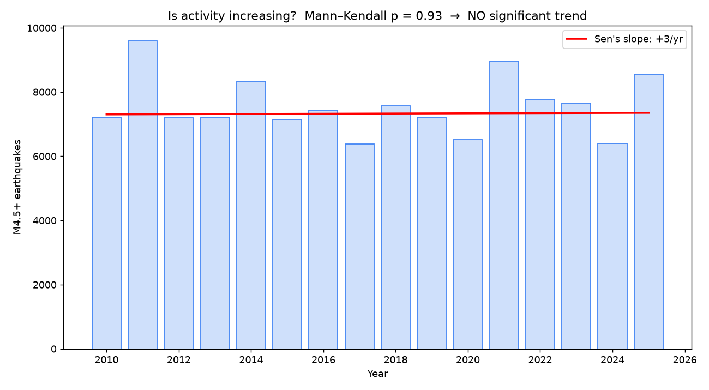
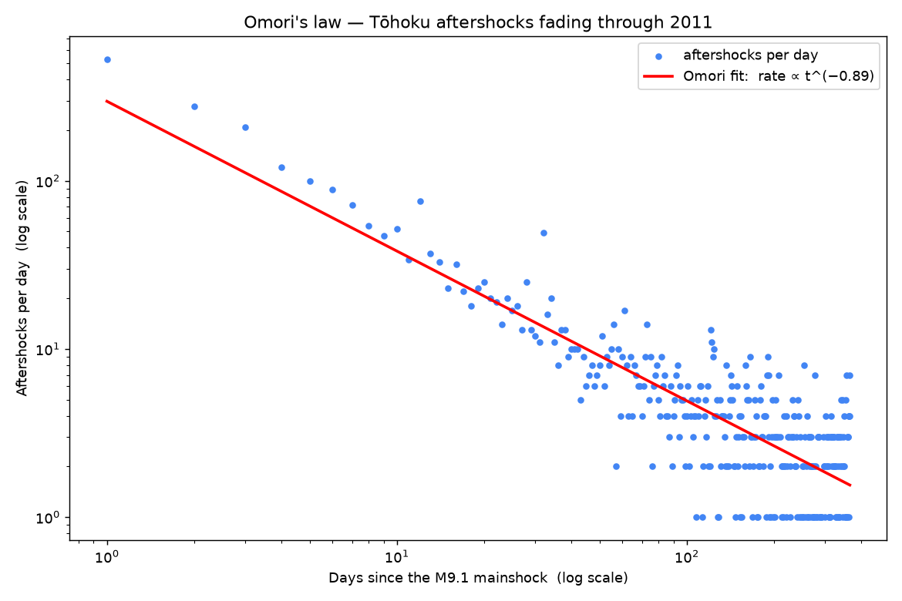
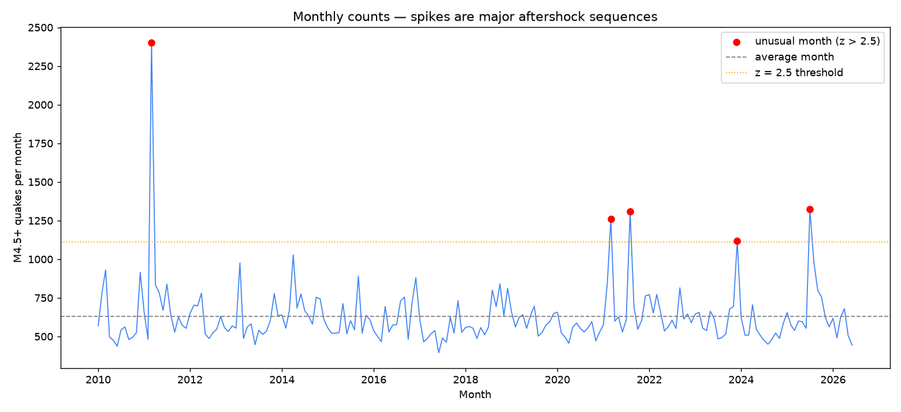
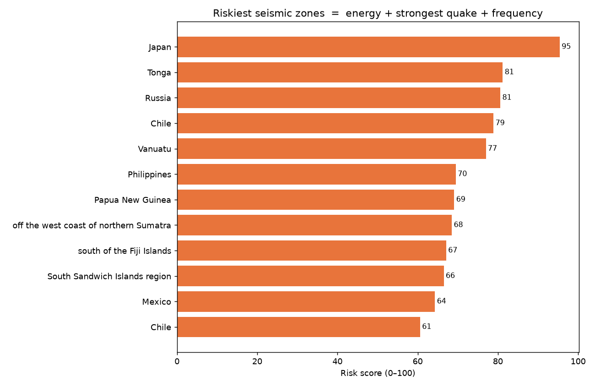

# Session 04 — Data Science, Part 2 (Phase 3)

**What we did:** four more real techniques — a trend test, the aftershock-decay law,
two kinds of anomaly detection, and an energy-based risk score — all saved into the
`analytics` schema.

---

## Method C1 — Is seismic activity increasing? (Mann–Kendall)

**Idea, simplest first:** a wiggly line of yearly counts fools the eye. The
**Mann–Kendall test** is the neutral way to ask "is there a *real* trend?" It returns
a **p-value** (below 0.05 = a real trend; above = can't claim one). **Sen's slope**
then measures the trend's size.

**Result:** p = **0.93**, Sen's slope **+3 quakes/year** → **no significant trend**
(2010–2025). So the common feeling that earthquakes are increasing is **not** in the
data — it's better news coverage and more sensors. *Being able to say "I tested it and
it's not real" is exactly the analytical maturity employers want.*

---

## Method C2 — Omori's law (how aftershocks fade)

**Idea, simplest first:** after a big quake, aftershocks are frequent then taper off.
Omori's law says the rate falls like **1 / time^p** (p usually ≈ 1). On a **log-log**
chart that's a straight line.

**Result:** the 3,313 aftershocks within 400 km of the 2011 M9.1 Tōhoku quake fade as
**t^−0.89** (R² = 0.71) — the law, confirmed on your own data. (The flat "stripes" at
the bottom right are just days with 1, 2, or 3 aftershocks far out in time.)

---

## Method D — Anomaly detection (two views)

**D1 — Per-quake (Isolation Forest).** *Idea:* given each quake's magnitude, depth and
location, the algorithm flags the **weird combinations** — points that are easy to
"isolate" from the crowd. The top hits were all **deep-focus quakes**:

| Quake | Magnitude | Depth |
|---|---|---|
| **2013 Sea of Okhotsk** | M8.3 | **598 km** |
| Bonin Islands, Japan | M7.8 | 664 km |
| Fiji | M7.9 | 671 km |

That first one is **the largest deep-focus earthquake ever recorded** — the method
found genuinely special events, not random noise. (Most quakes are shallow; ones 600 km
down are rare and physically unusual.)

**D2 — Per-month (z-score).** *Idea:* a **z-score** says how many standard deviations
above average a month is; > 2.5 is rare.

The biggest spike is **2011-03 (z = 9.2)** — the month Tōhoku and its thousands of
aftershocks hit. Others line up with real sequences (2021, and 2025-07 = the Kamchatka
M8.8).

---

## Method E — Seismic energy & a regional risk score

**Idea, simplest first:** counting quakes treats a M5 and a M9 the same, which is
absurd — energy ≈ **10^(1.5 × magnitude + 4.8)** joules, so **each +1 magnitude ≈ 32×
more energy**. We add energy up per zone and blend three danger factors into a 0–100
score: **total energy (50%) + strongest quake (30%) + how often it shakes (20%)**.

**Striking findings:**
- **Tōhoku alone released ~30% of ALL the seismic energy** in 16 years.
- The **15 quakes of M8+ (0.01% of events) released ~70%** of all energy. A handful of
  giants dominate everything — which is *why* energy, not counts, is the honest measure.
- Riskiest zones: **Japan (95)**, Tonga, Kamchatka/Russia, Chile, Vanuatu.

---

## The `analytics` schema is now full
Four results tables, ready for the API and dashboards:
`event_clusters`, `clusters`, `event_anomalies`, `zone_risk`.

## What's next — Phase 4: FastAPI
We've done the thinking; now we **serve** it. We'll build a small web **API** so other
programs (your map website, and anyone on the internet) can ask for this data — e.g.
"give me the riskiest zones" or "all quakes near Japan."
