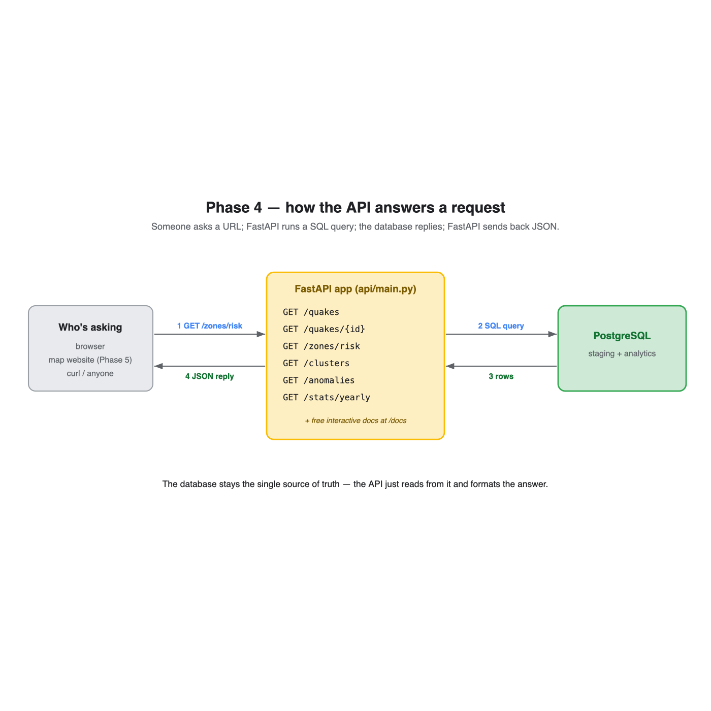

# Session 05 — FastAPI (Phase 4)

**What we did:** built a small **web API** — a set of URLs that hand back our
earthquake data and analysis as JSON, read live from PostgreSQL. This is the backend
the Phase 5 map website will talk to.



---

## Part A — FastAPI, from the simplest idea upward

### 1. What is an API? An endpoint?
An **API** is a doorway for programs. An **endpoint** is one URL behind it. When you
"GET" a URL like `/zones/risk`, the API runs some code and hands back data (as **JSON**
— the same text format our earthquakes arrived in).

### 2. Your first endpoint: a function becomes a URL
```python
@app.get("/")
def root():
    return {"name": "QuakeScope API"}
```
The line `@app.get("/")` says "when someone visits `/`, run this function." Whatever
you `return` (here a dictionary) FastAPI turns into JSON automatically.

### 3. Path parameters — part of the URL
```python
@app.get("/quakes/{quake_id}")
def get_quake(quake_id: str):
    ...
```
`{quake_id}` is a blank in the URL. Visiting `/quakes/us6000qw60` passes
`"us6000qw60"` straight into the function.

### 4. Query parameters — the bits after `?`, with built-in checks
```python
def list_quakes(min_magnitude: float = Query(4.5, ge=0, le=10),
                limit: int = Query(200, ge=1, le=2000)):
```
`/quakes?min_magnitude=7&limit=5` fills these in. The `ge`/`le` rules mean FastAPI
**rejects bad input for us** (e.g. magnitude 99) before our code even runs.

### 5. Reading the database — safely
```python
conn.execute(text("... WHERE magnitude >= :minmag"), {"minmag": min_magnitude})
```
We never glue user input directly into SQL (that's the classic "SQL injection"
security hole). Instead we leave a labelled blank `:minmag` and hand the value
separately, so the database treats it as data, never as code.

### 6. Rows → JSON, and errors
- A list of rows becomes a JSON array automatically (dates and numbers included).
- If something isn't found we raise `HTTPException(404, ...)` — the proper "not
  found" reply.

### 7. CORS — letting a website call us
One line (`CORSMiddleware`) gives a browser permission to call this API from a
different address — needed so the Phase 5 map page can fetch data.

### 8. The free gift: interactive docs
FastAPI reads our function signatures and builds a clickable test page at **`/docs`**
— no work from us. You can try every endpoint in the browser.

### 9. Running it
```bash
.venv/bin/uvicorn api.main:app --reload
```
`uvicorn` is the server that actually runs the app. `--reload` restarts it whenever
you save a change.

---

## Part B — The endpoints we built

| Endpoint | Returns | Reads from |
|---|---|---|
| `/quakes` | quakes, filterable by magnitude/date/region | `staging.events` |
| `/quakes/{id}` | one quake | `staging.events` |
| `/stats/yearly` | quakes per year | `staging.events` |
| `/zones/risk` | riskiest zones (Method E) | `analytics.zone_risk` |
| `/clusters` | seismic zones (Method A) | `analytics.clusters` |
| `/anomalies` | most unusual quakes (Method D) | `analytics.event_anomalies` + `staging.events` |

We tested them live — e.g. `/zones/risk` returned **Japan (95.4)**, Tonga, Kamchatka,
Chile, Vanuatu; `/anomalies` returned the **Sea of Okhotsk deep quakes**. Every one
reads straight from the database.

---

## Try it yourself
```bash
cd ~/quakescope
.venv/bin/uvicorn api.main:app --reload
```
Then open **http://127.0.0.1:8000/docs** in your browser and click around.

## What's next — Phase 5: the web map
Now that the data is *served*, we'll build an interactive **map website** (Leaflet)
that calls these endpoints and plots the quakes, zones and risk live in your browser —
your own custom dashboard.
