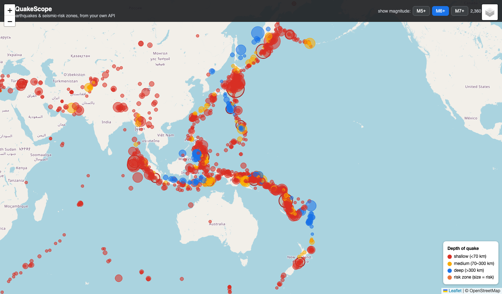

# Session 06 — The interactive web map (Phase 5)

**What we did:** built a map website that calls your API and plots every quake and
risk zone, live, in the browser. This is the first piece you can actually *show people*.



*(Red = shallow, amber = medium, blue = deep; dot size = magnitude; orange circles =
risk zones. The shape is the Pacific Ring of Fire — drawn from live API data.)*

---

## How a web page works, from the simplest idea upward

A website is three plain-text languages working together. We used all three.

### 1. HTML — the structure (the bones)
HTML describes *what's on the page* using tags. Ours is tiny: a header bar, an empty
box for the map, and the legend.
```html
<div id="map"></div>          <!-- the map will fill this box -->
```

### 2. CSS — the styling (the looks)
CSS says *how things look* — colours, sizes, positions. Ours (in the `<style>` block)
makes the map fill the screen and styles the dark header bar.
```css
#map { height: 100vh; width: 100%; }   /* 100vh = full screen height */
```

### 3. A library from a CDN — borrowing the map engine
We didn't build a map from scratch — we loaded **Leaflet** (a free map library) from
its public address (a "CDN"):
```html
<script src="https://unpkg.com/leaflet@1.9.4/dist/leaflet.js"></script>
```

### 4. Making the map (JavaScript)
JavaScript is the *behaviour* — the code that runs in the browser.
```js
const map = L.map("map").setView([10, 150], 3);   // centre on the Pacific
L.tileLayer("https://{s}.tile.openstreetmap.org/...").addTo(map);  // the background
```

### 5. fetch() — calling YOUR API from the browser
This is the key line that connects the front-end to everything you built:
```js
const res = await fetch(`/quakes?min_magnitude=${minMag}&limit=5000`);
const quakes = await res.json();      // the same JSON you saw in Phase 4
```
`fetch` asks the API for data; `await` means "wait for the reply"; `.json()` turns the
reply into usable data.

### 6. Drawing the data
For each quake we drop a coloured, sized dot with a click-popup:
```js
L.circleMarker([q.latitude, q.longitude], {
  radius: magRadius(q.magnitude),
  fillColor: depthColour(q.depth_km),
}).bindPopup(`<b>M${q.magnitude}</b> — ${q.place}`).addTo(quakeLayer);
```

### 7. Layers & interactivity
- Two **layers** (quakes, risk zones) with a toggle control.
- The **M5/M6/M7 buttons** re-run `fetch` with a new magnitude filter — so the map
  updates instantly when you click.

---

## How it all connects
The map is served by FastAPI at **`/app`**, so it lives at the *same address* as the
API. That's why it can call `/quakes` and `/zones/risk` directly — no CORS headaches,
one server doing both jobs.

```
browser  →  GET /app/        (the map page)
browser  →  GET /quakes ...   (the data)   →  FastAPI  →  PostgreSQL
```

## Run it yourself
```bash
cd ~/quakescope
.venv/bin/uvicorn api.main:app --reload
```
Then open **http://127.0.0.1:8000/app/** — pan, zoom, click a quake, toggle the
layers, switch magnitudes.

## What's next — Phase 6: Power BI
The last build phase, and the one résumé skill we saved for the end. We'll set up a
free Windows environment (Power BI Desktop is Windows-only), connect Power BI straight
to your PostgreSQL database, and build a polished business-intelligence dashboard from
the same `analytics` tables.
